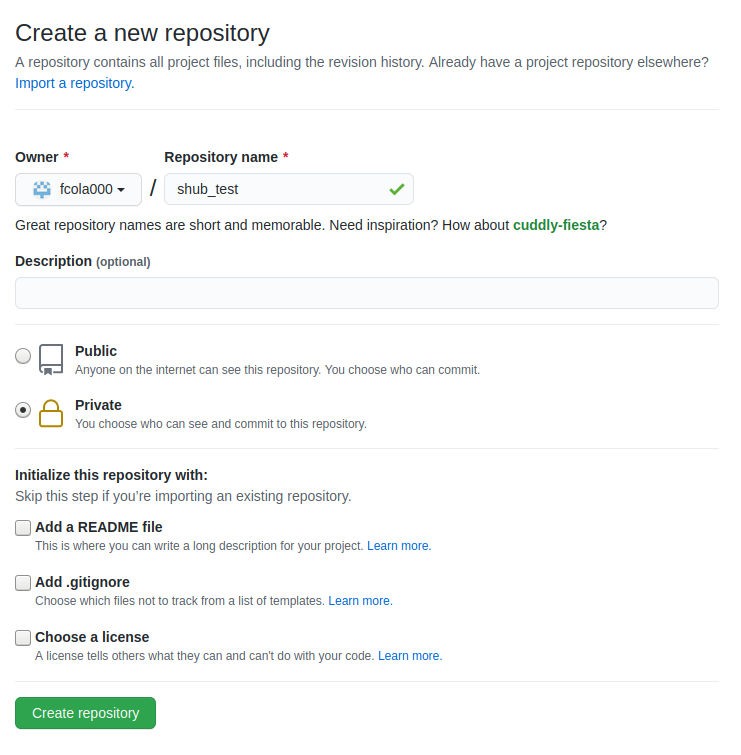
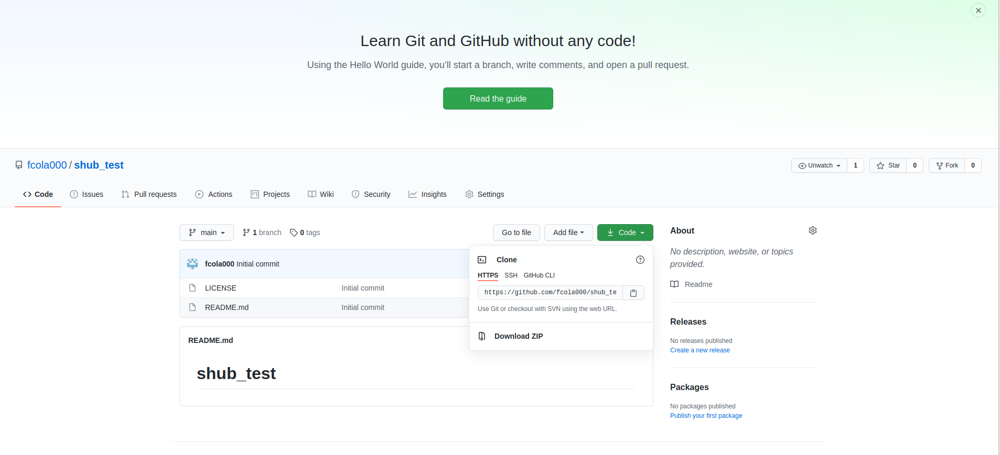
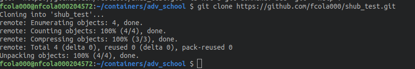
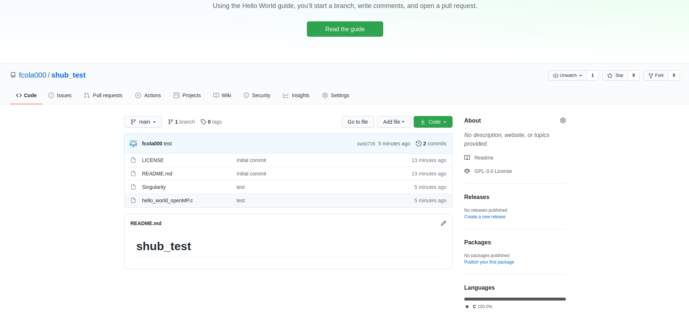
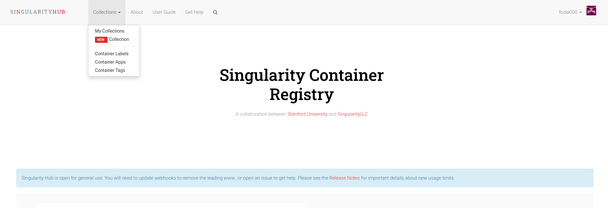
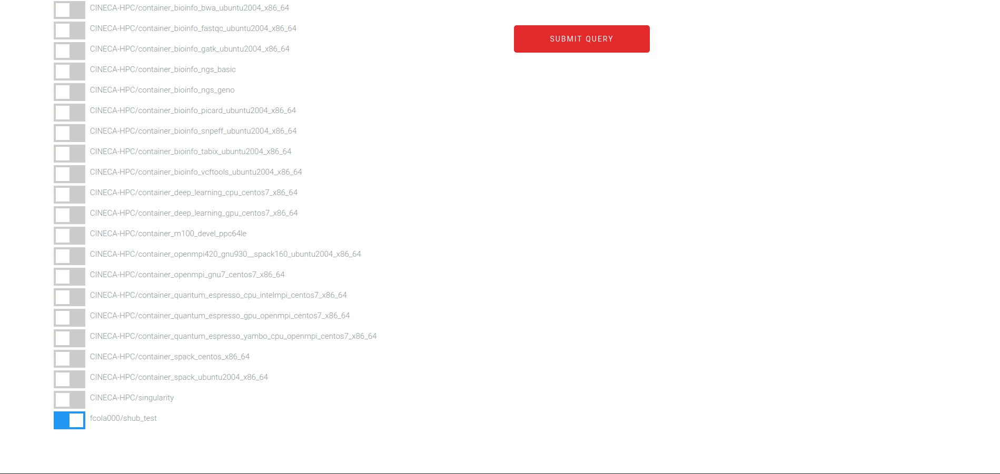
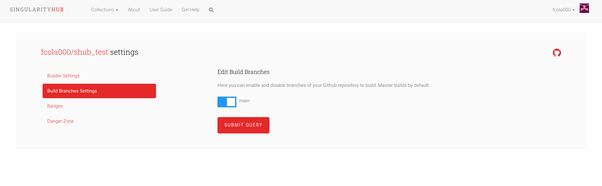
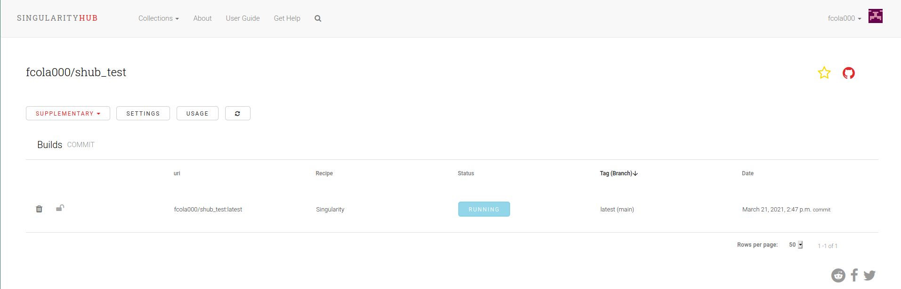

Exercise 05 - UPLOAD recipe to GitHub --> Singularity-Hub (image autobuild) --> HPC cluster
===========================================================================================

In case you work in a team and you want to share both your recipes and your container images with the rest of the community, git-hub and singularity-hub are the perfect instruments for you !

You can login in your git-hub account (create it, if you don't have). 

Create a new repository

After the creation of the repo you will see a new item into your repo list. If you click on the repo name you end up in a window like this. If you click on “Code” you will get an https address, copy it. 

Then you go in your terminal and write 

	$$ git clone <address_you_copied>

In this way you create a local copy of your repo on your laptop. 

This creates a new directory with the same name of the git-hub repo. 

Go inside the new directory and copy the file "hello\_world\_OpenMP.c" and our first recipe 'Singularity\_01' renaming it to 'Singularity' (very IMPORTANT later on for the autobuild). 

Execute the following commands in the terminal: 

	$$ git add *
	$$ git commit -m “test”
	$$ git push origin main

you will prompt to put your git-hub 'User' and 'Password'. 

If you do everything correctly you should see a message like this

Congratulations, now you uploaded your singularity recipe in git-hub !

If you go again to your git-hub repository you will notice the presence of the new file “Singularity” and the file "hello\_world\_OpenMP.c".

Now we will go to the singularity hub

and here we will create a new collection. 

We are accessing singularity-hub with the same account of our git-hub. 

This will allow us to select our git-hub repos to trigger the autobuild of the container image in our singularity-hub. 

After the creation of the new collection it is important to set the 'main' branch.

If you click on the name of your new collection and then on settings, you will finish in this window where you will switch to the 'main' branch.  We also suggest to use the latest availabe builder on Singularity Hub.

At this point the essential settings of the git-hub and singularity-hub are ready. 

Now, everytime you make a change to the 'Singularity' file in the git-hub directory in your laptop and you 'push' that change in your git-hub (as shown previously), this simple procedure will trigger the autobuild of the singularity container image in your singularity-hub

When the building procedure status will be completed without any error anyone will be able to download your singularity image on any computer using the command

	$$ singularity pull shub://<name_account>/<name_repo_container>

Then interact with it using the typical commands

	
	$$ singularity run <name_repo_container>_latest.sif

	$$ singularity exec <name_repo_container>_latest.sif ls /

	$$ singularity shell <name_repo_container>_latest.sif

