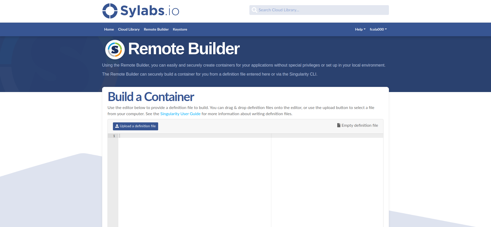
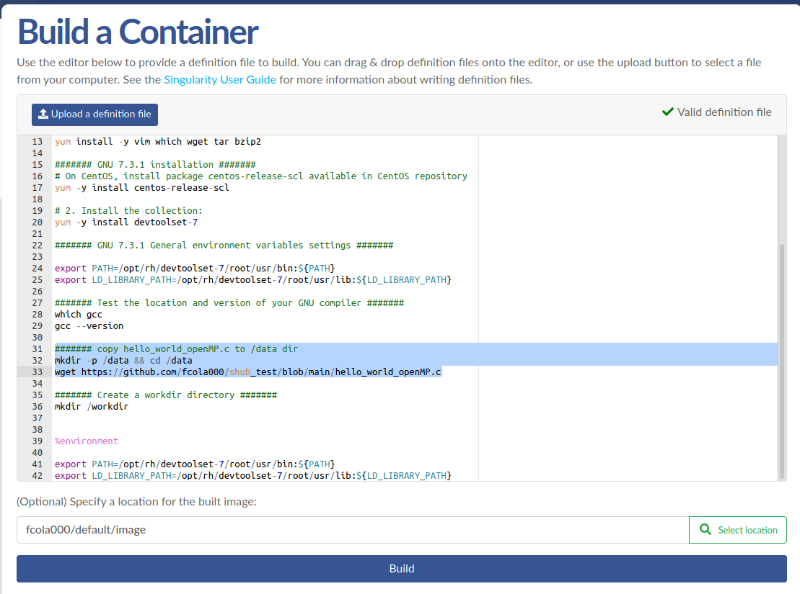
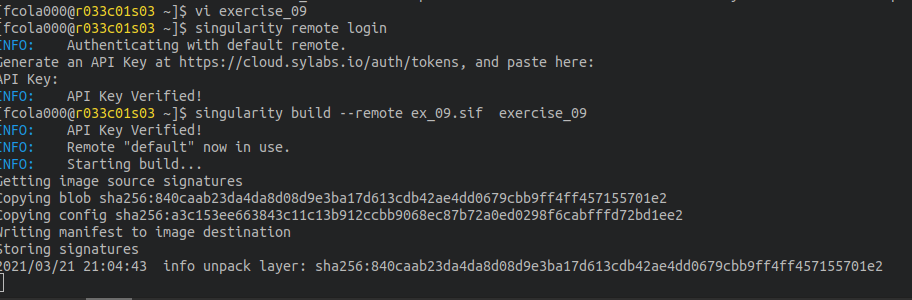

Exercise 06 - Singularity Library 
=================================

Singularity exec on a HPC cluster
---------------------------------

Access to singularity library (<https://cloud.sylabs.io>). If you don't have an access you can log in using GitHub credential.

Write or upload the recipe of exercise\_01. We have chosen the simplest recipe we have done today to minimize building time.

As you can imagine the recipe cannot be upload as it is, because in the **%files** section we copy the file "hello\_world\_openMP.c" into the container. 

We have to skip the %files section and there are 2 possibilities:

1. do not copy "hello\_world\_openMPI.c" (this option is not always available) 
2. use **wget** to copy the file inside the container from an external repository. In this case you can use the GitHub repository created for the exercise\_05

		
		mkdir -p /data && cd /data
		wget $ wget https://github.com/<account name>/<repo name>/main/hello_world_openMP.c

When you recipe is ok click on **Build** and wait Singularity Library builds your container. When it has done pull the container on an HPC cluster or workstation and test it.

	singularity pull library://<account name>/<repo name>/<image name>

	singularity run <image name>_latest.sif
	
	singularity exec run <image name>_latest.sif gcc --version
	
	singularity shell <image name>_latest.sif

Now you can try to build the same container using the flag **--remote** from the singularity command line, but first you need to make a little set up.

Create an access token using the link in the menu under your avatar. Execute the remote login and paste the token key in the command line

	$ singularity remote login

Now you can simply run singularity build command using the flag --remote. Wher it has done you can interact with it using the typical command *shell*, *run* or *exec*

	$ singularity build --remote <path_to_local_image> <path_to_local_recipe>

